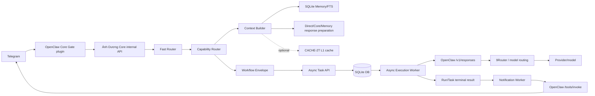

# ARCH-INVENTORY-RO-1 Report

## Runtime Truth

- FACT: Repo path is `/home/thadc/AIOS/anh-duong-core`.
- FACT: Branch is `master`; HEAD is `42be6ac`.
- FACT: Dirty tree existed before inventory and after inventory: 9 modified files and 6 untracked paths. The dirty files are mainly CACHE-2T and CE-related production work; this inventory did not stage, commit, reset, clean, or edit them.
- FACT: Core runs as systemd `anh-duong-core.service`, PID `123703`, working directory `/home/thadc/AIOS/anh-duong-core`, command `.venv/bin/uvicorn app.main:app --host 127.0.0.1 --port 8790`.
- FACT: `/health` returned `{"status":"ok","service":"Ánh Dương Core","version":"0.1.0"}` and `/ready` returned `{"status":"ready","database":"ok"}`.
- FACT: Listening ports include Core `127.0.0.1:8790`, 9Router `127.0.0.1:20128`, and OpenClaw Gateway ports `3978`, `18789`, `18790`.
- FACT: Runtime DB path is `/home/thadc/.local/state/anh-duong-core/anh_duong.db`; Alembic current revision is `0003` by read-only SQLite query.
- FACT: Runtime service env has `ANH_DUONG_INTERNAL_API_TOKEN=PRESENT`, `ANH_DUONG_OPENCLAW_AUTH_TOKEN=PRESENT`, `ANH_DUONG_CACHE_ENABLED=true`, `ANH_DUONG_CACHE_L1_ENABLED=true`, `ANH_DUONG_CACHE_L2_ENABLED=false`.
- FACT: Shell-local `Settings()` without service env reads tokens as missing and cache disabled; runtime process env is the source of truth for production.
- FACT: OpenClaw Gateway container is running/healthy; 9Router container is running.

## A. Project & Source

1. FACT: Project Overview: Ánh Dương Core is a FastAPI service that prepares Core requests, routes direct/memory/core/workflow intents, builds context, creates durable async tasks, executes via OpenClaw, and notifies Telegram through OpenClaw.
2. FACT: Tech stack: Python 3.12 project; FastAPI 0.139.2, Uvicorn 0.51.0, Pydantic 2.13.4, SQLAlchemy 2.0.51, Alembic 1.18.5, HTTPX 0.28.1, pytest 9.1.1, Ruff 0.16.0, mypy 1.20.2.
3. FACT: Folder structure: `app/api`, `app/async_tasks`, `app/audit`, `app/cache`, `app/capabilities`, `app/context_builder`, `app/db`, `app/memory`, `app/openclaw`, `app/orchestration`, `app/persona`, `app/policy`, `app/projects`, `app/routing`, `app/tasks`, `integrations/openclaw-anh-duong-core`, `alembic`, `docs`, `tests`.
4. FACT: System architecture: FastAPI app composes DB session factory, optional cache service, CoreRequestPipeline, async execution worker, notification worker, OpenClaw executor/notifier, and routers.
5. FACT: Module breakdown: routing/capability are deterministic classifiers; context_builder is deterministic assembly plus memory retrieval; async_tasks owns durable run lifecycle; openclaw owns Gateway HTTP boundary; policy owns risk/path gates; audit owns redaction and append-only JSONL.
6. INFERENCE: Dependency graph is layered: API -> orchestration/service -> repositories/models -> DB, with OpenClaw only at async worker/notifier boundary and Telegram only through integration plugin.
7. FACT: Tooling: `pyproject.toml` enables pytest, Ruff rules E/F/I/UP/B, mypy strict for `app`.

## B. Request & Business Runtime

8. FACT: Request flow: `POST /api/internal/requests/prepare` authenticates internal bearer, opens DB session, builds `CoreRequestPipeline`, returns `PreparedRequest`.
9. FACT: Direct vs Workflow: `FastRouter` selects direct/memory/core_read/workflow; `PreparedRequest.execution_required` must match workflow route; workflow route requires a `WorkflowEnvelope`.
10. FACT: Task/run lifecycle: `AsyncTaskService.create` creates Task, applies `AsyncTaskPolicyGate`, transitions Task to queued or blocked, enqueues `async_task_runs` with idempotency key.
11. FACT: Worker/notification flow: lifespan starts `AsyncTaskWorker` and `NotificationWorker` loops when async schema exists and worker is enabled. Execution worker claims run, marks running, calls OpenClaw, persists result, transitions terminal status, marks notification pending/not_required. Notification worker claims pending terminal notifications and calls OpenClaw `/tools/invoke`.
12. FACT: Important state transitions: `pending -> claimed -> running -> verifying -> completed/failed/blocked`; retry wait can re-claim; blocked can return to pending by manual retry; completed/failed/cancelled terminal. Risk >=4 forbidden; risk >=2 or approval_required blocked in Async Task Runner v1; build mode requires workspace.

## C. Data & Memory

13. FACT: DB is SQLite at `/home/thadc/.local/state/anh-duong-core/anh_duong.db`, WAL mode files present. Tables include projects, tasks, workflows, workflow_steps, approvals, memories, FTS tables, async_task_runs, audit_events, persona/policy versions, skills.
14. FACT: Alembic current revision `0003`; migrations are `0001_initial_schema`, `0002_memory_fts5`, `0003_async_task_runner_v1`.
15. FACT: Memory repository persists redacted memories and uses FTS5 external-content table/triggers; `HybridMemoryRetriever` ranks by lexical position, importance, confidence, recency.
16. FACT: CACHE-2T code exists in production dirty tree. Runtime has L1 enabled and L2 disabled. `CacheService` supports L1 RAM and L2 SQLite fail-open behavior; memory retrieval cache stores references/ranking metadata, not memory text.
17. FACT: Idempotency/retry semantics: async runs have unique task_id and idempotency_key; repository uses SQLite `BEGIN IMMEDIATE` for duplicate-key races; worker retries transport errors only when retryable and no uncertain side effect; stale recovery requeues only safe/idempotent low-risk runs.

## D. API, Auth, Security

18. FACT: Main endpoints: `GET /health`, `GET /ready`, `POST /api/internal/requests/prepare`, `POST /api/async-tasks`, `GET /api/async-tasks`, `GET /api/async-tasks/{run_id}`, `POST /api/async-tasks/{run_id}/retry`, `POST /api/async-tasks/{run_id}/cancel`.
19. FACT: Internal APIs require bearer token using `compare_digest`; if no configured token, API returns 503; invalid token returns 401.
20. FACT: Authorization/approval boundaries are policy-based: path allowlist `/mnt/f/AIOS` for async worker, risk catalog in PolicyEngine, no self-approval or forbidden actions.
21. FACT: Validation/error contracts use frozen Pydantic models, bounded string lengths, explicit HTTP 404/409/422/503 mappings.
22. FACT: Secrets/config management: Settings uses `ANH_DUONG_` env prefix and systemd EnvironmentFiles. Inventory verified secret env names only as PRESENT/MISSING.
23. FACT: Security controls include SecretRedactor, path-scope policy, audit redaction/fsync, deterministic router purity tests, internal bearer auth, fail-closed OpenClaw/API contract handling.

## E. AI / Agent Architecture

24. FACT: Core itself does not call provider SDKs. It calls OpenClaw Gateway with model `openclaw/default`; 9Router is a container/runtime dependency at `127.0.0.1:20128`. CE-2 proof used `cx/gpt-5.5` through 9Router in an isolated Gateway fixture.
25. FACT: Fast Router is deterministic phrase matching with workflow fallback for explicit side-effect/action phrases and direct fallback when no execution intent is detected.
26. FACT: Context Builder assembles persona, routing, project, task, memory, and current request sections with default 16k window, 3k response reserve, 1k runtime reserve, and deterministic UTF-8 byte token estimate.
27. FACT: Agent/tool execution boundary is OpenClaw Gateway: Core submits execution request to `/v1/responses`, not local shell/tool APIs.
28. FACT: Fallback/retry/timeout: OpenClaw timeout is 600s for execution and 30s for notification; HTTP status mapping distinguishes retryable gateway/rate errors from auth/contract errors; timeouts are uncertain side-effect for execution.
29. UNKNOWN: Cost/token governance beyond Context Builder budget and provider routing protection was not found in Core source.

## F. Operations

30. FACT: Runtime topology: systemd Core on WSL host port 8790; OpenClaw Gateway container exposes 18789/18790/3978; 9Router container exposes 20128 on localhost; SQLite DB under user state dir.
31. FACT: Service ownership: systemd service runs as user/group `thadc`; Docker containers are separate runtime dependencies.
32. FACT: Health/readiness: `/health` service/version and `/ready` database SELECT 1.
33. FACT: Logging/observability: uvicorn/systemd journal, append-only audit JSONL, async run audit events, OpenClaw plugin safe logs. No centralized metrics service found.
34. FACT: Deployment/release pattern: docs include systemd install/uninstall and checkpoint artifacts/rollback scripts; active service uses `/etc/systemd/system/anh-duong-core.service` plus drop-in env file.
35. FACT: Backup/recovery/rollback evidence exists in checkpoints for FS-1, CACHE-2T, and systemd runbooks; async stale run recovery exists in source.
36. INFERENCE: Dev/staging/prod separation is weak: production source tree is dirty and active runtime uses the same `/home/thadc/AIOS/anh-duong-core` working directory.
37. INFERENCE: Scalability constraints: SQLite single-node DB, in-process worker loops, local Gateway/9Router containers, and single uvicorn process constrain horizontal scaling.

## G. Governance

38. FACT: Active checkpoints/tasks: CE-2 local worktree artifact says PASS/CLOSED on 2026-08-09T143820Z, but production source lacks CE-2 patch. CACHE-2T latest L1 final says automated pass pending Telegram E2E; strict close still pending user-origin Telegram E2E. Earlier CACHE-2T-L1 attempt was BLOCKED.
39. FACT: Locked/stable/active/deprecated: Core API/routing/context/async are stable runtime surfaces; CACHE-2T is active development/runtime L1-only; CE-2/Codex result contract is worktree-closed but not production-applied; `.orig` and backup test files are deprecated/backup artifacts.
40. FACT: Known debt: production dirty tree; shell-local Settings drift from systemd runtime; no centralized metrics; CACHE clear_namespace L2 branch is pass/no-op; strict CACHE-2T Telegram E2E not closed.
41. FACT: ADR/decision records: docs/task design files exist for Fast Router, Capability Router, Core Request Pipeline, Memory FTS5, Hybrid Memory, Async Runner, Audit, systemd; no formal ADR directory found.
42. FACT: Architecture drift: docs say CACHE disabled default, runtime service env has cache L1 enabled; CE-2 closed artifact exists in worktree, but production `app/openclaw/models.py` still lacks CE-2 ResultContract fields.
43. PROPOSAL: Improvement candidates are listed in conclusion only; none implemented.

## Change Boundary Matrix

| Component | Runtime role | Source path | Status | Active checkpoint owner | Allowed change now? | Dependencies | Evidence |
| --- | --- | --- | --- | --- | --- | --- | --- |
| Telegram | User channel through OpenClaw plugin | `integrations/openclaw-anh-duong-core` | STABLE | TG/OpenClaw integration history | NO | OpenClaw, Core internal API | plugin tests/config and TG design docs |
| OpenClaw | Gateway for execution/notification | `app/openclaw`, integration plugin | STABLE | CE-2/TG boundaries | NO | Gateway container, auth token | container healthy, source executor/notifier |
| Ánh Dương Core | FastAPI runtime | `app/main.py`, `app/api` | STABLE | Core runtime | NO | DB, OpenClaw, policy, routing | systemd active, health/ready OK |
| Fast Router | Direct/memory/core/workflow classifier | `app/routing` | STABLE | FR-1 | NO | none except models | deterministic source/tests/docs |
| Capability Router | Capability classifier | `app/capabilities` | STABLE | CR-1 | NO | FastRoute | deterministic source/tests/docs |
| Context Builder | Prompt/context assembly | `app/context_builder` | STABLE | CB-1 | NO | persona, memory, token estimator | source/docs/tests |
| Memory | FTS persistence/retrieval | `app/memory`, DB `memories*` | STABLE | Memory/4.2 | NO | SQLite FTS5 | DB schema, source/docs |
| CACHE-2T | L1/L2 cache layer | `app/cache`, cached loaders/retrievers | ACTIVE_DEVELOPMENT | CACHE-2T | NO | Context/persona/memory, cache env | dirty files, runtime L1-only, checkpoint pending Telegram E2E |
| CE-2 / Codex execution path | ResultContract/Gateway proof | CE-2 worktree patch, `app/openclaw` production boundary | ACTIVE_DEVELOPMENT | CE-2 | NO | OpenClaw Gateway, 9Router | local closed artifact; production not patched |
| Async execution worker | Durable run executor | `app/async_tasks/worker.py` | STABLE | Async Runner v1, CACHE/CE touchpoints | NO | DB, policy, OpenClawExecutor | source/docs/tests |
| Notification worker | Final Telegram notifier | `app/async_tasks/notification.py`, `app/openclaw/notifier.py` | STABLE | Async Runner v1 | NO | DB, OpenClaw tools invoke | source/docs/tests |
| SQLite/Alembic | Persistence and schema | `app/db`, `alembic` | STABLE | Core runtime | NO | SQLAlchemy, SQLite | DB revision 0003, schema read-only |
| 9Router/model routing | Provider/model route behind Gateway | external container/runtime config | LOCKED | Provider/runtime governance | NO | 9router-docker, OpenClaw/Codex | container running, docs say protected |
| Policy | Risk/path authorization | `app/policy` | STABLE | Policy engine | NO | workspace roots | source/tests |
| Audit | Append-only redacted audit | `app/audit` | STABLE | Audit system | NO | state dir JSONL | source/docs |
| Projects/Tasks | Core business entities | `app/projects`, `app/tasks`, DB tables | STABLE | Core registry | NO | DB, audit | source/schema/tests |
| systemd service | Production process owner | `/etc/systemd/system/anh-duong-core.service` | LOCKED | Runtime ops | NO | env files, venv | systemctl status/cat |

## Dependency Map

## Gap Matrix

| # | Domain | Coverage | Status |
| --- | --- | --- | --- |
| 1 | Project Overview | Core purpose and runtime role identified | FACT |
| 2 | Tech Stack | versions verified from venv | FACT |
| 3 | Folder Structure | app/tests/docs/integration mapped | FACT |
| 4 | System Architecture | runtime topology and composition mapped | FACT |
| 5 | Module Breakdown | main packages summarized | FACT |
| 6 | Dependency Graph | map included | FACT/INFERENCE |
| 7 | Coding conventions/tooling | pyproject verified | FACT |
| 8 | Request Flow | prepare endpoint and pipeline traced | FACT |
| 9 | Direct vs Workflow | FastRoute and workflow validator traced | FACT |
| 10 | Task/Run lifecycle | service/repository/worker transitions traced | FACT |
| 11 | Worker/notification flow | lifespan workers and notifier traced | FACT |
| 12 | Business rules/state transitions | risk/workspace/idempotency summarized | FACT |
| 13 | DB engine/path/schema | sqlite path, tables, counts, revision verified | FACT |
| 14 | Alembic status | current revision 0003 | FACT |
| 15 | Memory architecture | repository/FTS/retrieval traced | FACT |
| 16 | Cache/CACHE-2T | runtime L1-only and checkpoint status traced | FACT |
| 17 | Transactions/idempotency/retry | repository locks/retry/recovery traced | FACT |
| 18 | API endpoints | endpoints listed | FACT |
| 19 | Authentication | bearer compare_digest traced | FACT |
| 20 | Authorization/approval | policy/risk/path gates traced | FACT |
| 21 | Validation/error contracts | Pydantic/FastAPI mappings traced | FACT |
| 22 | Secrets/config | env names and redaction policy verified | FACT |
| 23 | Security controls | redaction/path/audit/auth controls traced | FACT |
| 24 | Model/provider/router | Core/OpenClaw/9Router boundary traced | FACT |
| 25 | Capability/Fast Router | both deterministic routers traced | FACT |
| 26 | Context/token budget | default budget and estimator traced | FACT |
| 27 | Agent/tool boundaries | OpenClaw Gateway boundary traced | FACT |
| 28 | Fallback/retry/timeout | OpenClaw/status/retry logic traced | FACT |
| 29 | Cost/token governance | context budget only; cost unknown | UNKNOWN |
| 30 | Runtime topology | systemd/Docker/ports mapped | FACT |
| 31 | Service/process ownership | systemd user and PID verified | FACT |
| 32 | Health/readiness | endpoints verified | FACT |
| 33 | Logging/observability | journal/audit/plugin logs identified | FACT |
| 34 | Deployment/release | systemd/runbook/checkpoints identified | FACT |
| 35 | Backup/recovery | checkpoint backups and stale recovery identified | FACT |
| 36 | Isolation | dirty prod tree indicates weak separation | INFERENCE |
| 37 | Scalability | SQLite/in-process/single-node constraints | INFERENCE |
| 38 | Active checkpoints | CE-2 and CACHE-2T states recorded | FACT |
| 39 | Component status | boundary matrix included | FACT/INFERENCE |
| 40 | Technical debt | drift/dirty tree/no metrics noted | FACT/INFERENCE |
| 41 | ADR/decisions | task docs exist; no ADR dir found | FACT |
| 42 | Drift | CACHE runtime/doc and CE production/worktree drift | FACT |
| 43 | Improvement candidates | conclusion lists only, no implementation | PROPOSAL |

## Self Review

- FACT: No tests, migrations, installs, restarts, commits, staging, resets, deploys, DB writes, or service mutations were performed.
- FACT: Only artifact writes were made under `/mnt/f/AIOS/anh-duong-checkpoints/ARCH-INVENTORY-RO-1/`.
- FACT: Secrets are redacted or represented as PRESENT/MISSING.
- FACT: Change Boundary Matrix, Dependency Map, Runtime Truth, and Gap Matrix are present.

ARCH-INVENTORY-RO-1 = PASS
